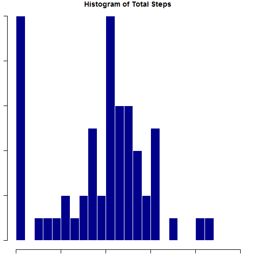
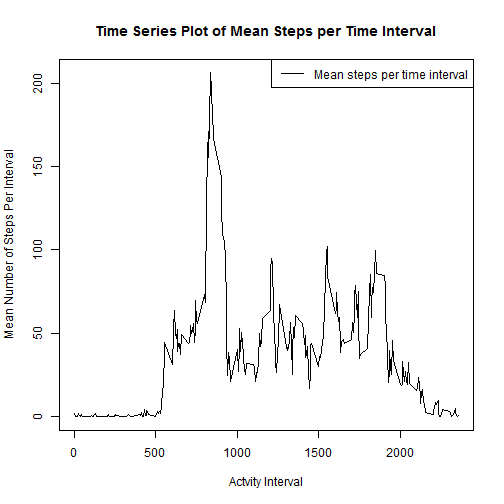
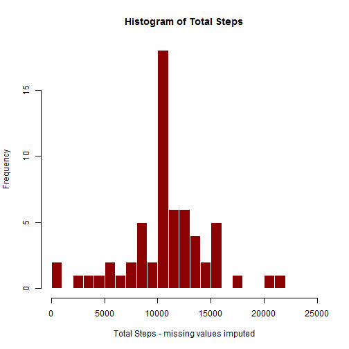
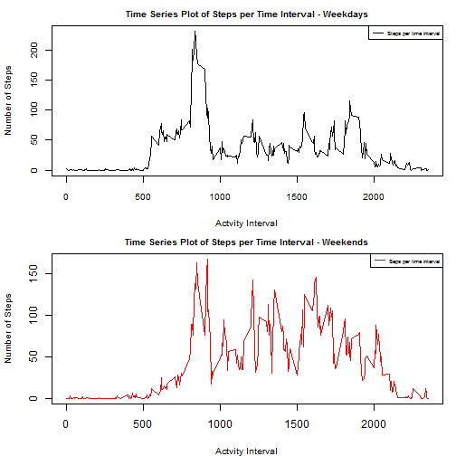

Week 2 Peer Graded Assignment
=============================
## Activity Monitoring - steps per five-minute time interval

### Total number of steps taken per day.  
  
The following is a table of the total number of steps per day:
<!-- html table generated in R 3.3.2 by xtable 1.8-2 package -->
<!-- Wed Mar 01 20:10:04 2017 -->
<table border=1>
<tr> <th> Date </th> <th> Total Steps </th> <th> Date </th> <th> Total Steps </th> <th> Date </th> <th> Total Steps </th>  </tr>
  <tr> <td> 2012-10-01 </td> <td align="right">   0 </td> <td> 2012-10-22 </td> <td align="right"> 13460 </td> <td> 2012-11-12 </td> <td align="right"> 10765.00 </td> </tr>
  <tr> <td> 2012-10-02 </td> <td align="right"> 126 </td> <td> 2012-10-23 </td> <td align="right"> 8918 </td> <td> 2012-11-13 </td> <td align="right"> 7336.00 </td> </tr>
  <tr> <td> 2012-10-03 </td> <td align="right"> 11352 </td> <td> 2012-10-24 </td> <td align="right"> 8355 </td> <td> 2012-11-14 </td> <td align="right"> 0.00 </td> </tr>
  <tr> <td> 2012-10-04 </td> <td align="right"> 12116 </td> <td> 2012-10-25 </td> <td align="right"> 2492 </td> <td> 2012-11-15 </td> <td align="right"> 41.00 </td> </tr>
  <tr> <td> 2012-10-05 </td> <td align="right"> 13294 </td> <td> 2012-10-26 </td> <td align="right"> 6778 </td> <td> 2012-11-16 </td> <td align="right"> 5441.00 </td> </tr>
  <tr> <td> 2012-10-06 </td> <td align="right"> 15420 </td> <td> 2012-10-27 </td> <td align="right"> 10119 </td> <td> 2012-11-17 </td> <td align="right"> 14339.00 </td> </tr>
  <tr> <td> 2012-10-07 </td> <td align="right"> 11015 </td> <td> 2012-10-28 </td> <td align="right"> 11458 </td> <td> 2012-11-18 </td> <td align="right"> 15110.00 </td> </tr>
  <tr> <td> 2012-10-08 </td> <td align="right">   0 </td> <td> 2012-10-29 </td> <td align="right"> 5018 </td> <td> 2012-11-19 </td> <td align="right"> 8841.00 </td> </tr>
  <tr> <td> 2012-10-09 </td> <td align="right"> 12811 </td> <td> 2012-10-30 </td> <td align="right"> 9819 </td> <td> 2012-11-20 </td> <td align="right"> 4472.00 </td> </tr>
  <tr> <td> 2012-10-10 </td> <td align="right"> 9900 </td> <td> 2012-10-31 </td> <td align="right"> 15414 </td> <td> 2012-11-21 </td> <td align="right"> 12787.00 </td> </tr>
  <tr> <td> 2012-10-11 </td> <td align="right"> 10304 </td> <td> 2012-11-01 </td> <td align="right">   0 </td> <td> 2012-11-22 </td> <td align="right"> 20427.00 </td> </tr>
  <tr> <td> 2012-10-12 </td> <td align="right"> 17382 </td> <td> 2012-11-02 </td> <td align="right"> 10600 </td> <td> 2012-11-23 </td> <td align="right"> 21194.00 </td> </tr>
  <tr> <td> 2012-10-13 </td> <td align="right"> 12426 </td> <td> 2012-11-03 </td> <td align="right"> 10571 </td> <td> 2012-11-24 </td> <td align="right"> 14478.00 </td> </tr>
  <tr> <td> 2012-10-14 </td> <td align="right"> 15098 </td> <td> 2012-11-04 </td> <td align="right">   0 </td> <td> 2012-11-25 </td> <td align="right"> 11834.00 </td> </tr>
  <tr> <td> 2012-10-15 </td> <td align="right"> 10139 </td> <td> 2012-11-05 </td> <td align="right"> 10439 </td> <td> 2012-11-26 </td> <td align="right"> 11162.00 </td> </tr>
  <tr> <td> 2012-10-16 </td> <td align="right"> 15084 </td> <td> 2012-11-06 </td> <td align="right"> 8334 </td> <td> 2012-11-27 </td> <td align="right"> 13646.00 </td> </tr>
  <tr> <td> 2012-10-17 </td> <td align="right"> 13452 </td> <td> 2012-11-07 </td> <td align="right"> 12883 </td> <td> 2012-11-28 </td> <td align="right"> 10183.00 </td> </tr>
  <tr> <td> 2012-10-18 </td> <td align="right"> 10056 </td> <td> 2012-11-08 </td> <td align="right"> 3219 </td> <td> 2012-11-29 </td> <td align="right"> 7047.00 </td> </tr>
  <tr> <td> 2012-10-19 </td> <td align="right"> 11829 </td> <td> 2012-11-09 </td> <td align="right">   0 </td> <td> 2012-11-30 </td> <td align="right"> 0.00 </td> </tr>
  <tr> <td> 2012-10-20 </td> <td align="right"> 10395 </td> <td> 2012-11-10 </td> <td align="right">   0 </td> <td>  </td> <td align="right">  </td> </tr>
  <tr> <td> 2012-10-21 </td> <td align="right"> 8821 </td> <td> 2012-11-11 </td> <td align="right"> 12608 </td> <td>  </td> <td align="right">  </td> </tr>
   </table>
    
  
The following is a histogram of the total number of steps taken each day:

The mean of the total number of steps per day: 9354.2295082  
The median of the total number of steps per day: 10395

### Daily Activity Pattern  
The time series plot the 5-minute interval and the average number of steps taken, averaged across all days.

  
The five-minute interval, on average across all the days in the dataset, that contains the maximum number of steps is 835

### Imputing missing values.

The total number of missing values is 2304.  
We impute the missing values by using the average number of steps for that time interval.

    
### Comparing Weekday values to Weekend values.  
The following two plots compare activity in average steps per time interval for weekends and weekdays.

  
These two plots show that on weekends activity begins later but rises to a peak more quickly than on weekdays.  There is also more activity on weekends during the day.
